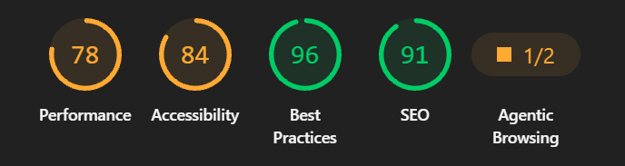

# Gelatieri-Team — Premium Gelato Landing Page

A modern, responsive landing page for an artisanal gelato shop. Showcases gelato
products, shares the brand's rich tradition, highlights customer reviews, and
provides franchise and location information. Built with a mobile-first approach
and optimized for accessibility and performance.

---

## Table of Contents

- [About](#about)
- [Features](#features)
- [Technologies](#technologies)
- [Getting Started](#getting-started)
  - [Prerequisites](#prerequisites)
  - [Install & Run](#install--run)
  - [Build](#build)
- [Project Structure](#project-structure)
- [Usage](#usage)
- [Contributing](#contributing)
- [Credits](#credits)
- [License](#license)

---

## About

Gelatieri-Team is a sophisticated landing page designed for a premium gelato
brand. It emphasizes quality, tradition, and customer experience through an
elegant, adaptive layout built with modern front-end technologies and best
practices.

## Features

- Mobile-first, responsive design (mobile, tablet, desktop)
- SCSS (Sass) with reusable variables, mixins, and BEM naming conventions
- Semantic HTML with SEO-friendly meta tags
- Interactive JavaScript modules for enhanced UX
- Swiper.js carousel integration for product showcases
- Parcel 2 bundler for optimized builds
- PostHTML includes for modular component organization
- Code formatting and linting via Prettier and Husky
- Automatic deployment pipeline to GitHub Pages
  

## Technologies

- HTML5
- SCSS (Sass)
- JavaScript (ES6+)
- Swiper.js
- Parcel 2
- Node.js
- npm
- Prettier
- Husky
- lint-staged
- PostHTML
- modern-normalize

## Getting Started

### Prerequisites

- Node.js (v16+ recommended)
- npm (comes with Node.js)

### Install & Run (development)

1. Install dependencies:

   ```bash
   npm install
   ```

2. Start the dev server:

   ```bash
   npm start
   ```

The dev server serves `src/index.html` with automatic hot-reloading (Parcel is
configured to watch and rebuild on file changes).

### Build (production)

To create a production-optimized build:

```bash
npm run build
```

The compiled and minified files will be generated in the `dist/` directory,
ready for deployment.

## Project Structure

- `src/`
  - `index.html` — main entry point
  - `sass/` — SCSS modules and component styles (variables, mixins, utilities)
  - `js/` — vanilla JavaScript modules for interactivity
  - `partials/` — reusable HTML components (header, hero, products, reviews,
    footer, etc.)
  - `images/` — static assets (images, icons, favicon)
  - `assets/` — additional resources
- `.husky/` — Git hooks configuration (runs linters and formatters pre-commit)
- `.parcel-cache/` — Parcel bundler cache for fast rebuilds
- `dist/` — production build output
- `package.json` & `package-lock.json` — project dependencies and npm scripts
- `.editorconfig` — enforces consistent text formatting across editors
- `.prettierrc` & `.prettierignore` — code formatting rules
- `.htmlnanorc` — HTML optimization settings
- `.parcelrc` — Parcel bundler configuration
- `.posthtmlrc` — PostHTML configuration for includes
- `.sassrc` — Sass compiler configuration
- `.gitignore` — specifies files to ignore in version control
- `LICENSE` — ISC license
- `README.md` — project documentation

## Usage

To get a local copy up and running, follow these steps.

### Prerequisites

Make sure you have **Node.js** installed on your computer (required to use
`npm`). Download it from [nodejs.org](https://nodejs.org/).

### 1. Clone the repository

Open your terminal and run:

```bash
git clone https://github.com/AlexKim71/gelatieri-team.git
```

### 2. Navigate to the project folder

```bash
cd gelatieri-team
```

### 3. Install dependencies

Install all required packages (Parcel, Swiper, Husky, Prettier, etc.):

```bash
npm install
```

### 4. Run the development server

Start the local development server with live-reloading:

```bash
npm start
```

> **Note:** The project will automatically open in your default browser. If not,
> manually navigate to [http://localhost:1234](http://localhost:1234).

> **Note:** Husky + lint-staged automatically run Prettier on staged files at
> commit time, ensuring consistent code formatting without manual intervention.

### 🛠 Production Build

To build an optimized production version for deployment, run:

```bash
npm run build
```

> The compiled and minified files will be generated in the `dist/` directory.

## Contributing

Contributions are welcome! Follow this recommended workflow:

1. Fork the repository
2. Create a feature branch (`git checkout -b feature/your-feature`)
3. Make your changes and test locally with `npm start`
4. Commit your changes (Prettier formatting is applied automatically via git
   hooks)
5. Push to your branch and open a pull request

Please keep code style consistent—Prettier is pre-configured and runs
automatically on commit.

## Credits

- **Author:** Alexander Gavrylov
- **Repository:**
  [github.com/AlexKim71/gelatieri-team](https://github.com/AlexKim71/gelatieri-team)
- **Images and assets:** Located in `src/images/` (review licenses if reusing
  externally)

## License

This project is licensed under the ISC License. See the LICENSE file for
details.
